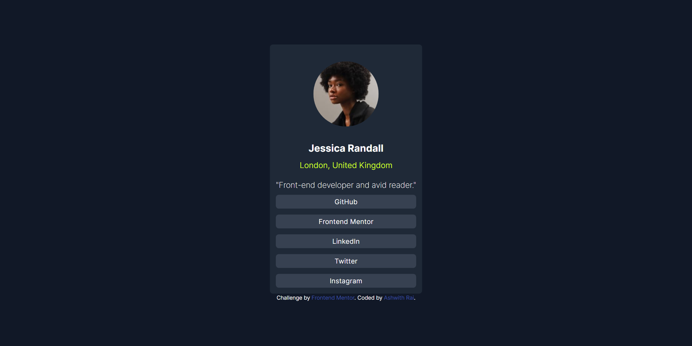
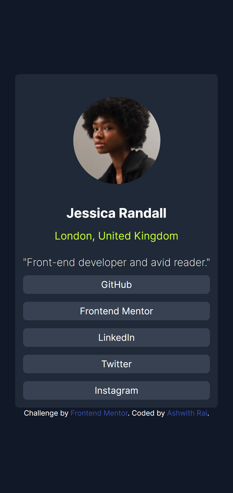

# Frontend Mentor - Social links profile solution

This is a solution to the [Social links profile challenge on Frontend Mentor](https://www.frontendmentor.io/challenges/social-links-profile-UG32l9m6dQ). Frontend Mentor challenges help you improve your coding skills by building realistic projects. 

## Table of contents

- [Overview](#overview)
  - [The challenge](#the-challenge)
  - [Screenshot](#screenshot)
  - [Links](#links)
- [My process](#my-process)
  - [Built with](#built-with)
  - [Useful resources](#useful-resources)
- [Author](#author)

## Overview

### The challenge

Users should be able to:

- See hover and focus states for all interactive elements on the page

### Screenshot

### Links

- Solution URL: [Solution](https://github.com/Rai-shwith/FM-Challenge-Social-links-profile)
- Live Site URL: [Live site](https://rai-shwith.github.io/FM-Challenge-Social-links-profile/)

## My process

### Built with

- Semantic HTML5 markup
- CSS custom properties
- Flexbox
- Mobile-first workflow
- Tailwind CSS

### Useful resources

- [Tailwind Documentation](https://tailwindcss.com/docs/) .

## Author

- Frontend Mentor - [@Rai-shwith](https://www.frontendmentor.io/profile/Rai-shwith)
- GitHub - [@Rai-shwith](https://github.com/Rai-shwith)